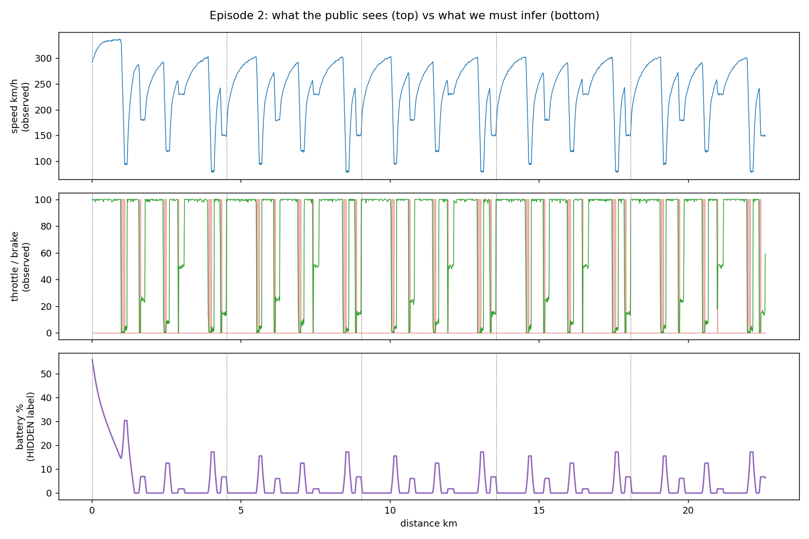
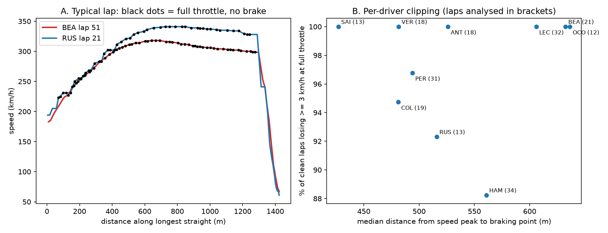

# ERS-Lens

**Estimating the hidden battery state of 2026 Formula 1 cars from public telemetry.**

> Status: work in progress, Phase 1 of 4 (physics simulator + data pipeline).

## The problem

The 2026 regulations split power roughly 50/50 between the combustion engine and a
350 kW electric motor (MGU-K). How a team harvests and deploys battery energy now
decides races. But F1 does not publish ERS state in its public data feed: battery
charge, deploy and harvest are all unavailable (confirmed by the FastF1 maintainer,
[discussion #861](https://github.com/theOehrly/Fast-F1/discussions/861)).

ERS-Lens infers that hidden state lap by lap, with uncertainty, from what *is*
public: speed, throttle, brake and position.

The same problem, estimating a battery's state of charge from indirect signals,
appears in EV battery management and grid storage.

## Approach

There is no ground truth for real cars, so the project is built in stages:

1. **Physics simulator (done).** A quasi-steady-state lap simulator with 2026 energy
   rules (MGU-K power cap and high-speed taper, per-lap harvest limit, battery window,
   active-aero drag modes). It runs many plausible team strategies and records the true
   battery state, producing labelled training data.
2. **Estimators (next).** A physics-based baseline (Kalman-style filter), then a sequence
   model trained on synthetic data and adapted to real telemetry.
3. **Validation without labels.** Checks against observable signatures: top-speed
   clipping, energy-conservation bounds, Override Mode bursts.
4. **Race replay dashboard.** Per-driver battery curves and "harvesting vs attacking"
   lap labels.



*Simulated flat-out strategy: once the battery empties after lap 1, main-straight top
speed drops from ~337 to ~302 km/h. The public sees only the top two panels.*

## How the simulator works

- **Track from telemetry.** A real fast lap marks where the car is grip-limited
  (throttle < 98%, so the real speed is kept as a ceiling) and where it is
  power-limited (flat out, left open so physics and energy decide the speed).
- **Braking envelope.** A backward pass finds the highest speed at every point that
  still allows every corner ahead to be made.
- **Forward pass.** Every 5 m, the energy policy requests deploy or harvest; the
  simulator enforces the regulations and battery limits, then integrates speed,
  time and state of charge with efficiency losses.
- **Sim-to-real.** Output is resampled to ~4 Hz, speed rounded to whole km/h and
  brake reduced to on/off to match the public feed. Car parameters are randomized
  per episode (domain randomization).

## Quick start

```bash
python -m venv .venv && source .venv/bin/activate
pip install -e ".[real,dev]"
pytest                                   # physics invariant tests
python scripts/make_synthetic.py --episodes 200
python scripts/plot_episode.py data/synthetic/demo_synthetic.parquet --episode 2
python scripts/fetch_session.py --event China   # real 2026 data via FastF1
python scripts/make_synthetic.py --track data/real/2026_china_track.npz
```

## Limitations (honest list)

- Car parameters in `configs/car_2026.yaml` are estimates; values marked VERIFY come
  from press summaries of the regulations and must be checked against the FIA text.
- Corner speeds are copied from a reference lap, not derived from tyre grip.
- Override Mode and lift-and-coast are not modelled yet.
- No tyre degradation, traffic or weather yet.

Data: [FastF1](https://github.com/theOehrly/Fast-F1). Not affiliated with Formula 1 or the FIA.

## Result: 2026 Chinese Grand Prix (SSAC27 abstract)



On quality-controlled laps, 92.9% show the car losing speed at full throttle on
Shanghai's back straight: evidence of near-universal energy "super-clipping".
69% of candidate laps were rejected by physical plausibility checks; without
them, the data produces spurious driver differences.

Reproduce:

```bash
python scripts/fetch_session.py --event China --drivers ANT RUS HAM LEC BEA GAS LAW HAD SAI COL HUL LIN BOT OCO PER VER ALO STR
python scripts/derate_analysis.py --track data/real/2026_china_track.npz --races data/real/2026_china_*_race.parquet
python scripts/abstract_figure.py --track data/real/2026_china_track.npz --race-glob "data/real/2026_china_{drv}_race.parquet"
```

## Result: seven 2026 races, before and after the FIA's Miami rule change


On 2,924 quality-controlled race laps, cars spent 34.7% of the longest straight losing
speed at full throttle before the Miami rule change and 34.1% after (exact permutation
test over races, p = 0.51): no measurable change in race clipping.

Reproduce: `python scripts/multi_race.py --session R --events Australia China Japan Miami Canada Austria Belgium`
