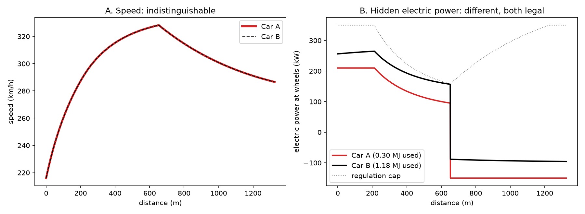
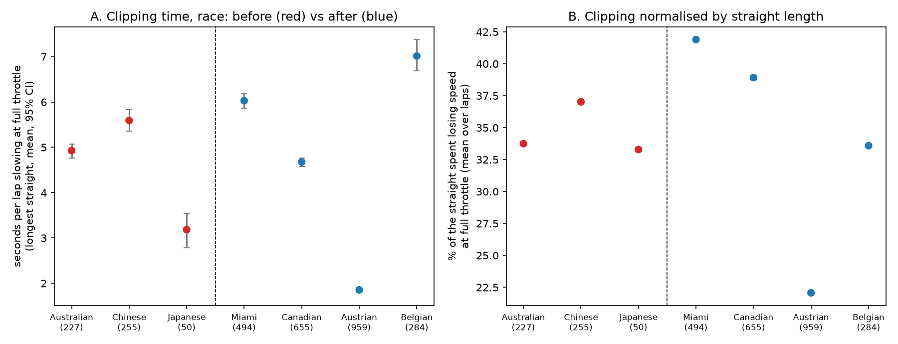
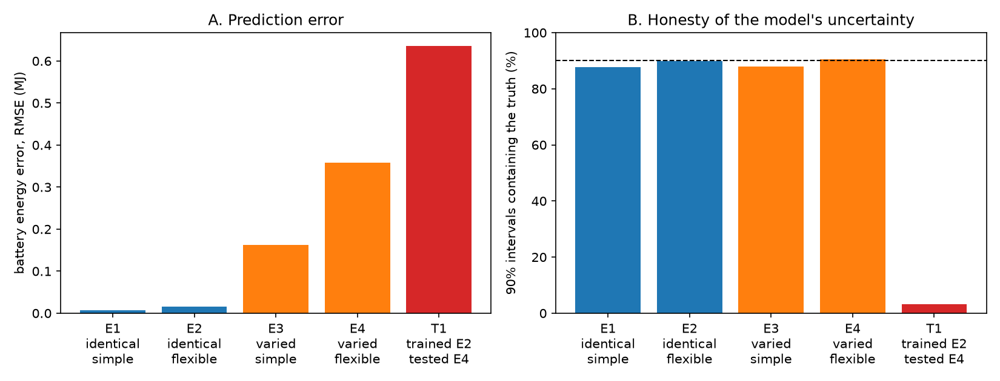

# ERS-Lens

**What public telemetry can and cannot reveal about 2026 Formula 1 energy management.**

The 2026 regulations split power roughly equally between a ~400 kW combustion engine and a
350 kW electric motor (MGU-K), so battery deployment decides races. But battery charge,
deployment and harvesting are absent from the public timing feed
([FastF1 discussion #861](https://github.com/theOehrly/Fast-F1/discussions/861)).
ERS-Lens works out what an outsider can still learn from speed, throttle and brake data,
and measures it across the 2026 season.

> Status: active research. Every hypothesis is recorded in
> [`docs/research_log.md`](docs/research_log.md), including the ones that failed.

## Key findings

### 1. A car's battery state cannot be recovered from speed telemetry

On a full-throttle straight, a car with more engine power, more drag and a different
electric deployment can produce exactly the same speed trace. Electric power is identifiable
from speed only up to an unknown function of speed, so battery energy is not identifiable.



Searching every regulation-legal alternative (deployment within the speed-dependent MGU-K
cap at every instant) with identical telemetry, battery energy used on one straight spans:

| ICE power known to within | Drag area known to within | Battery energy spread | Share of 4 MJ window |
| --- | --- | --- | --- |
| ±10% | ±20% | 2.53 MJ | 63% |
| ±5% | ±10% | 1.65 MJ | 41% |
| ±2% | ±5% | 0.76 MJ | 19% |

Reproduce: `python scripts/identifiability_demo.py`

### 2. The drop in electric power during clipping *can* be measured

On a clipping lap the car passes each speed twice at full throttle: accelerating before the
speed peak and decelerating after it. At equal speed, drag, rolling resistance and engine
power cancel, leaving only the change in electric power:

```
ΔP_e = (ΔKE + m·g·Δz_up) / T_up + (ΔKE − m·g·Δz_down) / T_down,   ΔKE = ½·m·(v_hi² − v_lo²)
```

It needs only the car's mass and the circuit's elevation profile, never drag or engine
power, so it returns the same answer for every car in finding 1. On 40 simulated cars
with 4 Hz sampling, whole-km/h rounding and noise: correlation **0.992** with the true
power drop, mean error **19.5 kW** on a 328 kW mean, no false detections.

### 3. Seven races: clipping is near-universal, and the Miami rule changes did not change it

| Race (2026) | Period | Clean laps | Laps clipping ≥3 km/h | Clipping time | Median power drop |
| --- | --- | --- | --- | --- | --- |
| Australia | before | 227 | 97% | 4.9 s | 187 kW |
| China | before | 255 | 93% | 5.6 s | 179 kW |
| Japan | before | 50 | 86% | 3.2 s | 185 kW |
| Miami | after | 494 | 96% | 6.0 s | 177 kW |
| Canada | after | 655 | 98% | 4.7 s | 206 kW |
| Austria | after | 959 | 82% | 1.9 s | 279 kW |
| Belgium | after | 284 | 96% | 7.0 s | 125 kW |

Measured on each circuit's longest interior straight. Normalised by straight length, cars
spent 34.7% of the straight losing speed at full throttle before the FIA's Miami changes and
34.1% after (exact permutation test with races as the unit, p = 0.51).



### 4. Most 2026 public telemetry needs cleaning first

Physical plausibility checks (sample gaps, frozen or stale speed, braking into the corner,
flat-out run length) kept **2,924 of 6,400** candidate race laps. Without them, Shanghai
data suggested Gasly clipped on 24% of laps against 94% for teammate Colapinto in the same
car; after cleaning, the difference disappeared. It came from corrupted telemetry.

### 5. Neural networks trained in simulation can be confidently wrong

The identifiability result predicts a failure mode for machine learning: a network trained
on simulated laps where every car is identical can learn battery energy through the
simulator's fixed car parameters, not the physics. Predictions were committed to the
research log before any training run.



| Training and test data | RMSE (MJ) | 90% intervals containing the truth |
| --- | --- | --- |
| Identical cars | 0.008–0.016 | 88–90% |
| Varied cars (ICE ±10%, drag ±20%) | 0.16–0.36 | 88–90% |
| **Trained on identical cars, tested on varied cars** | **0.64** | **3%** |

Trained on identical cars, the network claims ±0.017 MJ certainty while its real error is
0.64 MJ: about 37 times overconfident. Trained across realistic car variation, it reports
honest uncertainty instead (predicted ±0.32 MJ against 0.36 MJ actual error). Near-perfect
accuracy on simulated races is therefore weak evidence for real-race performance unless
the simulator varies the car. One of five predictions failed: restricting strategies to a
simple family did not make battery energy learnable.

Status: single seed and one architecture so far; multi-seed runs and a capacity/data
control are next. Reproduce: `python scripts/ml_identifiability.py`

### 6. Hypotheses tested

None of the six hypotheses below held. All were stated before their tests; four were also
recorded in the research log beforehand.

| Hypothesis | Result |
| --- | --- |
| Clipping share falls after the Miami changes | Not supported (34.7% vs 34.1%, p = 0.51) |
| Harvest power after clipping rises after Miami | Not supported |
| Elevation correction moves Austria and Spa towards flat circuits | Not supported |
| Deployment before clipping rose after Miami (held-out test: every later race ≥ 0.45) | Not confirmed (Italy 0.40) |
| Ramp-limited clipping fits better on ≥5 of 7 circuits | Not supported (1 of 7) |
| Regulation taper formula improves agreement between estimators | Not supported (0.55 → 0.54) |

## Repository

```
configs/car_2026.yaml       car and regulation parameters (sources noted per value)
src/erslens/
    physics.py              forces, braking envelope, MGU-K speed taper (single shared implementation)
    simulate.py             lap simulator with 2026 energy rules (NumPy)
    jaxsim.py               differentiable simulator in JAX, verified against simulate.py
    energy.py               matched-speed estimator with elevation correction
    straightfit.py          3-parameter clipping fit (step and ramp models)
    synthstraight.py        simulated straights for the ML experiment (JAX)
    gaussnet.py             neural network with calibrated Gaussian uncertainty (JAX, Optax)
    ingest.py               FastF1 loading, track and elevation profiles
scripts/
    derate_analysis.py      quality checks and full-throttle speed-loss detection
    multi_race.py           clipping across races, before/after comparison
    energy_real.py          matched-speed estimates on real races
    straight_real.py        parametric fits, model comparison, sensitivity
    energy_validate.py      estimator validation against simulated ground truth
    identifiability_demo.py finding 1
    ml_identifiability.py   finding 5
tests/                      45 automated tests (physics invariants, estimators, quality checks)
docs/research_log.md        dated log of every decision, prediction and result
results/                    per-lap and per-race outputs
```

## Reproduce

```bash
python3.12 -m venv .venv && source .venv/bin/activate
pip install -r requirements-lock.txt
pip install -e . --no-deps
python -m pytest

python scripts/identifiability_demo.py
python scripts/ml_identifiability.py
python scripts/energy_validate.py
python scripts/multi_race.py --session R --events Australia China Japan Miami Canada Austria Belgium
python scripts/energy_real.py --events Australia China Japan Miami Canada Austria Belgium
python scripts/straight_real.py --events Australia China Japan Miami Canada Austria Belgium
```

Raw telemetry is Formula 1 timing data downloaded through [FastF1](https://github.com/theOehrly/Fast-F1)
and is not redistributed here.

## Limitations

- The MGU-K taper formula (1800 − 5v kW below 340 km/h, 6900 − 20v kW from 340 km/h) is
  confirmed in the [FIA 2026 Power Unit Technical Regulations, Issue 6](https://www.fia.com/sites/default/files/fia_2026_formula_1_technical_regulations_pu_-_issue_6_-_2024-03-29.pdf)
  (29 March 2024); later issues have not been checked. A 50 kW/s ramp limit comes from a
  secondary source only, and the data reject it as a description of clipping. The power-drop
  estimator depends on neither.
- Results cover full-throttle straights only; one straight per circuit. Circuits whose
  longest straight crosses the start/finish line or ends in a fast corner cannot be measured.
- Car mass is assumed (768 kg plus a nominal fuel load); a 5% error shifts power drops by ~5%.
- Slipstream and Override Mode are not yet separated from clipping.
- Real battery data are not public, so validation relies on simulation and agreement between
  two estimators.

## Related work

The closest work is [Kleisarchaki (2026)](https://arxiv.org/abs/2603.01290), an HMM–POMDP
framework for inferring rival ERS state from telemetry, evaluated on synthetic races.
Optimal ERS control for known cars goes back to Limebeer, Perantoni and Rao (2014,
*International Journal of Control*). ERS-Lens is the empirical, observation-side complement:
what an outsider can verify from public data.

## Licence

MIT. Independent work, not affiliated with Formula 1, the FIA or any team.
Contact: Priyanshi Sharma, [github.com/Priyanshi507](https://github.com/Priyanshi507).
